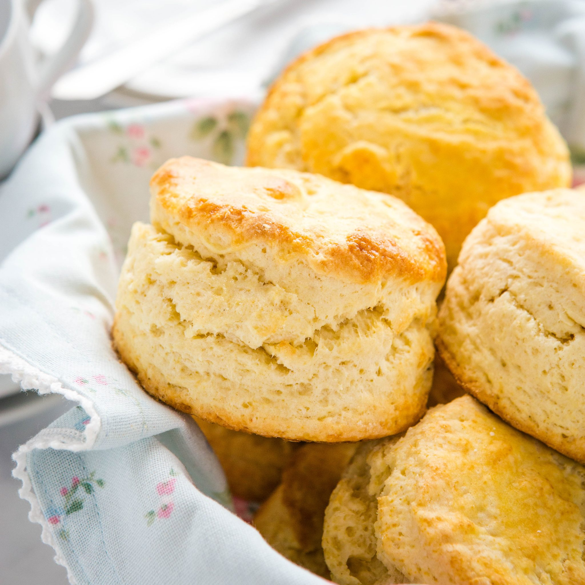

# 20220919 
## 20220919
### 20220919
#### 20220919
##### 20220919

🍪 🥞



Emphasis, aka *italics*, with asterisiks.

Strong emphasis, aka bold, with **asterisks** or **underscores**.

Combined emphasis with **asterisks and underscores**.

Strikethrough uses two tildes. ~~Scratch this~~.

---

>1. First ordered list item
>2. Another item
>>* Unordered sub-list.
>3. Actual numbers don't matter, just that it's a number
>>1. Ordered sub-list
>>2. and
>4. And another item
>>* note 1
>>* note 2
>>>* note3

---

 - [ ] todo list
 - [X] done
 
 ---
python code 
 ```python
s = "Python syntax highlighting"
print s
```
---
javascript code
```java
var s = "Javacripst syntax highlight"
alerts(s);
```
---
Colons can be used to align columns.
| Tables        | Are           | Cool |
| :------------ |:-------------:| -----:|
| col 3 is      | right-aligned | $1600 |
| col 2 is      | centered      |   $12 |
| zebra stripes | are neat      |    $1 |

There must be at least 3 dashes separating each header cell.

The outerpipes(|)are optional, and you don't need to make the
 
raw Markdown line up prettily.You can also use inline Markdown.
| Markdown | Less    | Pretty     |
| :------- |:-------:| ----------:|
| *Still*  | `renders` | **nicely** |
| 1        | 2       | 3          |

**PERT/CPM 圖**


**甘特圖**

